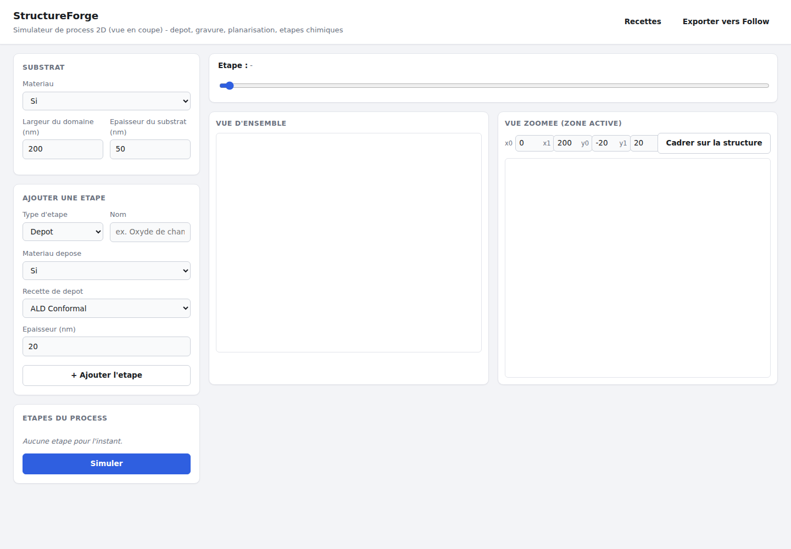
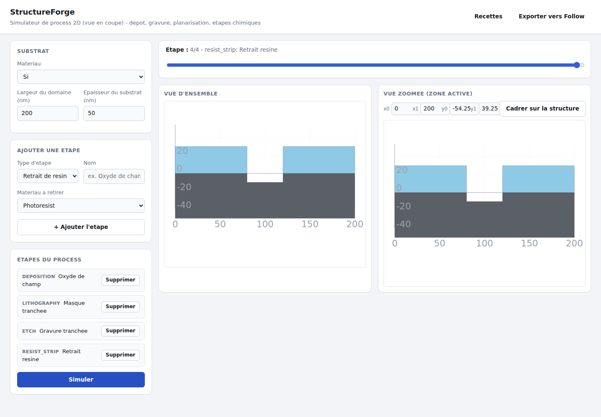
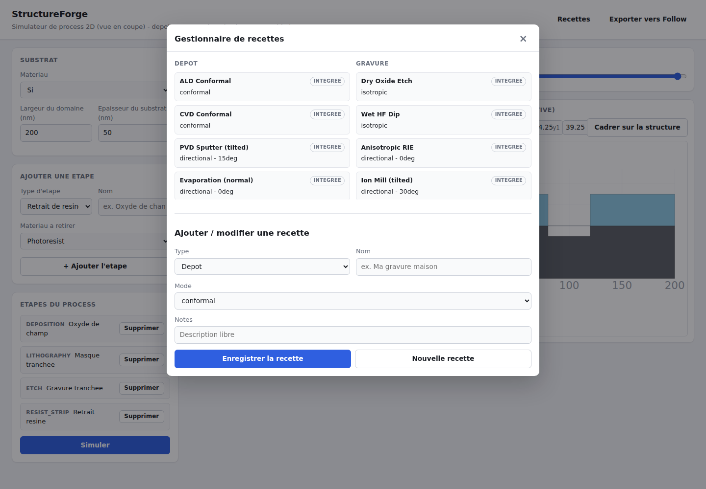
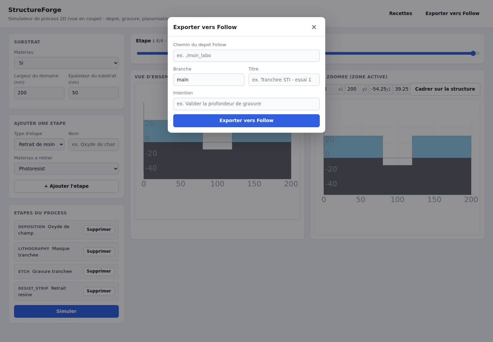

# Structure de l'interface

Cette page décrit l'organisation de l'interface web de StructureForge. Pour l'installer et la
lancer, voir la section [Interface graphique web](../README.md#interface-graphique-web) du
README principal.

## Vue d'ensemble

Au chargement, la page se divise en trois zones :

- une **barre du haut** (topbar) avec le titre et deux boutons qui ouvrent les fenêtres modales
  (Recettes, Exporter vers Follow) ;
- une **barre latérale** (sidebar), qui reste toujours visible et concentre le nécessaire pour
  construire un process : substrat, ajout d'étape, liste des étapes ;
- une **zone de canevas** (canvas-area) à droite, avec le curseur d'historique (timeline) et les
  deux vues SVG (vue d'ensemble / vue zoomée).

Les fonctions plus occasionnelles - gestion des recettes et export Follow - ont été sorties de la
barre latérale pour ne pas l'encombrer en permanence : elles s'ouvrent à la demande dans des
fenêtres modales (voir plus bas).

## Barre latérale : construire un process

La sidebar empile trois panneaux :

1. **Substrat** - matériau, largeur du domaine et épaisseur du substrat.
2. **Ajouter une étape** - le type d'étape choisi (dépôt, gravure, planarisation, lithographie,
   retrait de résine, étape chimique) fait apparaître les champs propres à ce type (matériau,
   recette, épaisseur, angle, ouvertures de masque...).
3. **Étapes du process** - la liste ordonnée des étapes déjà ajoutées (avec suppression
   individuelle), et le bouton **Simuler** qui déclenche le calcul de toutes les frames.

## Zone de canevas : historique et vues multi-échelle

Après simulation, le curseur d'historique en haut de la zone de canevas permet de parcourir chaque
étape du process image par image. Les deux vues SVG en dessous se mettent à jour ensemble :

- **Vue d'ensemble** - tout le domaine simulé.
- **Vue zoomée (zone active)** - une fenêtre définie numériquement (x0/x1/y0/y1) ou calée
  automatiquement sur la structure via **Cadrer sur la structure** ; c'est la vue utile pour
  les structures multi-échelle (nanofil, zone active EBL...) où le détail est trop fin pour être
  lisible dans la vue d'ensemble.

Les deux vues affichent une grille et des axes gradués en nanomètres (graduation choisie
automatiquement selon l'étendue affichée), pour donner une échelle de lecture qui manquait aux
premières versions du canevas.

## Fenêtres modales

### Gestionnaire de recettes

Ouvert depuis le bouton **Recettes** de la topbar. Liste les recettes de dépôt et de gravure
disponibles (badge « intégrée » pour les recettes livrées avec StructureForge, « personnalisée »
pour celles créées ici), avec un formulaire pour en créer, dupliquer ou modifier une (mode, angle,
facteur par défaut, sélectivité par matériau/catégorie, notes). Une recette personnalisée qui porte
le nom d'une recette intégrée la remplace tant qu'elle existe. Toute recette créée ici est aussitôt
utilisable dans le panneau **Ajouter une étape**, et persiste d'une session à l'autre (voir la
section [Gestionnaire de recettes](../README.md#gestionnaire-de-recettes) du README pour le détail
du stockage).

### Exporter vers Follow

Ouvert depuis le bouton **Exporter vers Follow** de la topbar. Permet d'envoyer le process simulé
(la structure finale et son historique d'étapes) vers un dépôt [Follow](https://github.com/DmHoly/Follow)
existant : chemin du dépôt, branche, titre et intention de l'expérience.

Les deux modales se ferment de la même façon : bouton de fermeture (`×`), clic en dehors de la
fenêtre, ou touche `Échap`.
